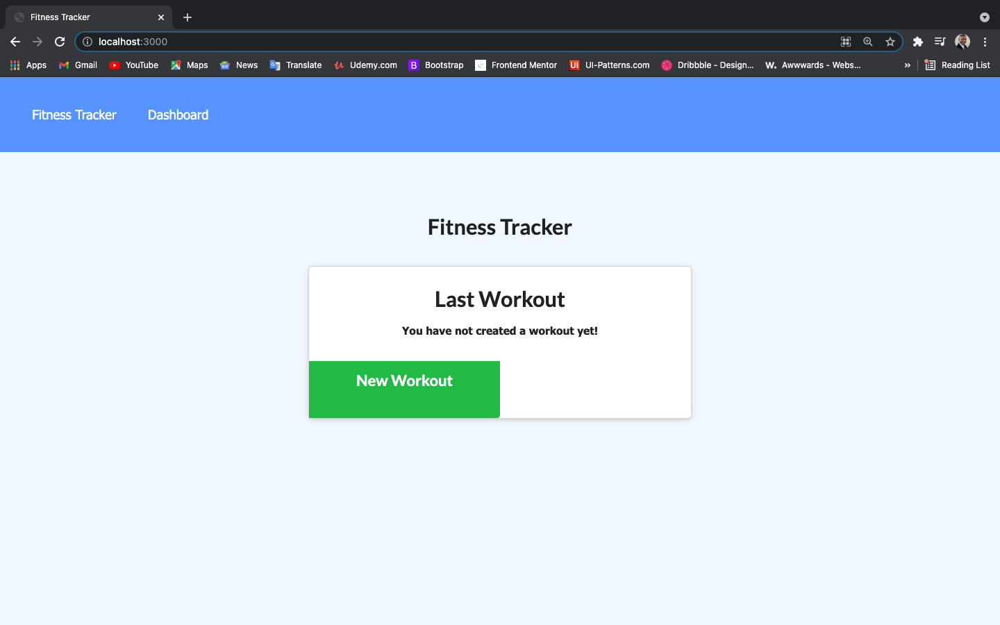
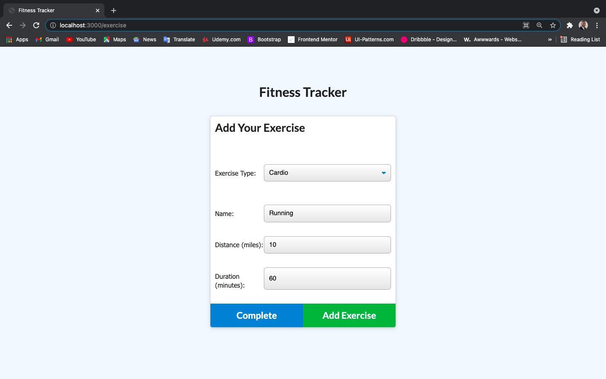
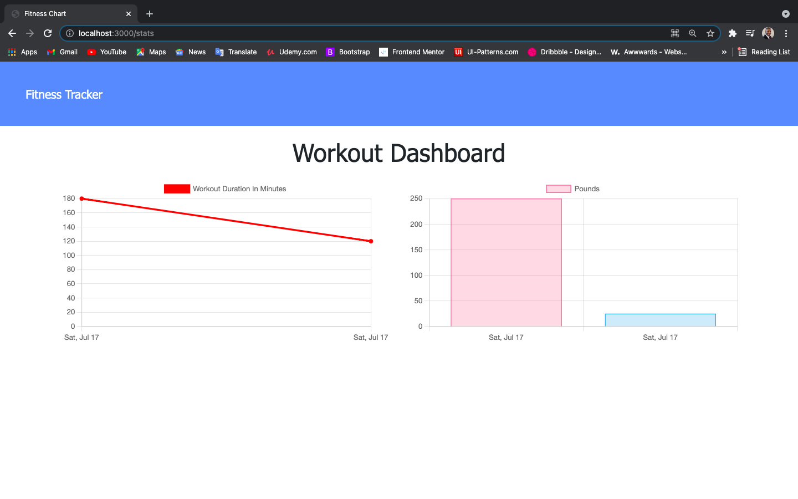

# Fitness-Tracker

* This is a fitness application so that you can keep track of your daily workouts. This app allows you to focus on your progress, by showing you the results of your workout in the form of a graph. Over time, you can keep track of how well you are doing and what workouts work best for you. This web application will allow you to enter in information about your workouts online and offline if you don't have temporary internet access.

---

## User Story

* As a user, I want to be able to view create and track daily workouts. I want to be able to log multiple exercises in a workout on a given day. I should also be able to track the name, type, weight, sets, reps, and duration of exercise. If the exercise is a cardio exercise, I should be able to track my distance traveled.

---

## Operation

* Below you will see the first screen that will allow you to create an entry for a new workout. 

* This is where you will enter in the information about your workout.

* You can continue a current workout or have the option to click on the Dashboard to see your results. You can even enter in more workouts when you click the Fitness Tracker.

* You can see your results on the provided graph below, which is located on the Dashboard.

---

## App Information & Links

* This app uses HTML, CSS, JavaScript, Express.js, Mongoose, MongoDB, & MongoDB Atlas to allow you to track the workouts that matter to you. This web application is deplyed on the Heroku platform and stored on the GitHub.com platform.

* You can reach this app live using the following link to Heroku: https://stevenson-workout-tracker.herokuapp.com/

* The code for this app can be found on the GitHub: https://github.com/sawhite110/Fitness-Tracker.git